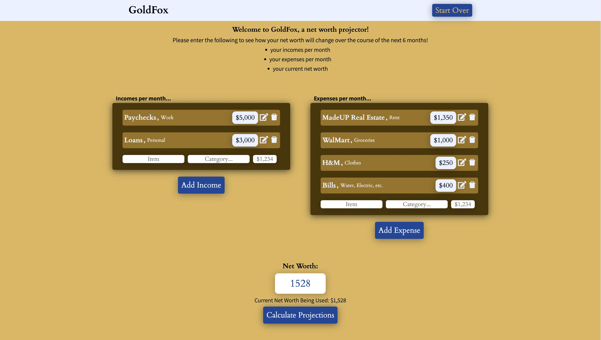
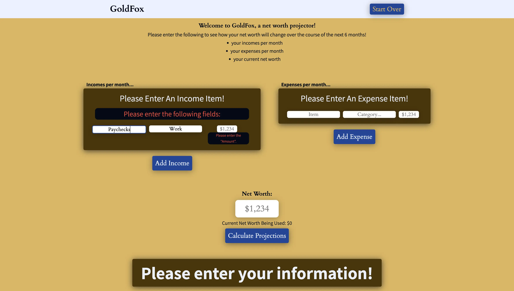

# GoldFox Net-Worth Calculator

Welcome to GoldFox!  This project was made to be a simple net-worth calculator app.  It was built using [TypeScript](https://www.typescriptlang.org/) and [React](https://reactjs.org/) with [Redux](https://redux.js.org/) as a state management tool.  It takes in any number of monthly incomes or expenses you have, as well as your starting net worth, and uses that information to give you a projected net worth on a month-by-month basis over the next 6 months.  Although that is it's core functionality at the present, this project not a sprint, but a marathon -- I plan to build it into a fully-featured budget application that I will use for all of my financial needs.

#### Table of Contents
- [Features](#features)
  - [Net Worth Calculation](#net-worth-calculation)
  - [Editing Existing Income or Expense Items](#editing-existing-income-or-expense-items)
- [How It Is Built](#how-it-is-built)
- [Challenges](#challenges)
- [Updates For The Future](#updates-for-the-future)

## Features

For now, GoldFox is capable of the following:

### Net Worth Calculation

Using a simple algorithm, the app can use the user's input incomes and expenses to give a month-by-month snapshot to the user regarding their net worth.  It tells them what their projected net worth will be, as well as the difference (positive or negative) between the last month.  It notifies the user if their net worth has reached zero, or has gone into the negatives accordingly.

### Editing Existing Income or Expense Items

The user is also allowed to edit any existing entries into the income or expense column.  The app will let the user know if what they've entered (either in the edit form or the add form) needs to be corrected, and will only let the user enter valid information.  

## How It Is Built

The app is built with the following four areas, each of which has their own respective components:

 - [Balance](#balance)
 - [Budget](#budget)
 - [Calculations](#calculations)
 - [Header](#header)
 - [Helpers](#helpers)
    - [Hooks](#hooks)
    - [Redux Store](#redux-store)
    - [Tests](#tests)

### Balance

The [Balance component](/src/components/balance/Balance.tsx) is where the user's current balance lives.  It contains a form that will trigger the net worth calculations to take place when the user submits it.  The only item inside the form is the input where the user puts their current net worth.  This net worth will be what is used to calculate the projected 6 months.  For example, if a user is to input $1,000, then the projections will start with an initial amount of $1,000.

### Budget

The Budget area is where everything related to the income items and expense items live.  In this category, we have the following components:

  - ['Add Item' Component](/src/components/budget/AddItem.tsx)
    - This component handles the form submission for adding an item or an expense.  It handles form validity, as well as passing the information to the Redux store, where a list of all the incomes and expenses are held.
  - ['Budget' Component](/src/components/budget/Budget.tsx)
    - This component simply handles rendering the income and expense category components.
  - ['Category' Component](/src/components/budget/Category.tsx)
    - This component handles the details of rendering a single income/expense component.  It can render either, and the 'Budget' component renders both versions, first the income component, and then the expense.  The Category component renders the items that already exist, as well as the component to add items to the items list.
  - ['Item' Component](/src/components/budget/Item.tsx)
    - This component handles rendering the item, as well as handling its editable form.  The editable form has validity just like the 'Add Item' component does.
  - ['Items' Component](/src/components/budget/Items.tsx)
    - This component is simply responsible for rendering each item into an 'Item' component in a list structure.

### Calculations

These components are simply responsible for taking the calculated data given to it by the Redux store and displaying it on the user interface for the user to see.  The ['Calculations' Component](/src/components/calculations/Calculations.tsx) simply renders the container, and renders a ['Month' component](/src/components/calculations/Month.tsx) for each of the 6 months.

### Header

The [Header component](/src/components/header/Header.tsx) is responsible for rendering the top bar, as well as the ['Start Over' button](/src/components/header/StartOver.tsx), which will reset the application when clicked.

### Helpers

The following helpers were needed when creating this application.  This is where the core of the application resides.

#### Hooks

One custom React hook was necessary to build the application without excessive duplication, and that was a [useValidity hook](src/hooks/useValidity.tsx).  This handled the form validity of both the 'Add Item' component form, as well as the 'Edit Item' component form.

#### Redux Store

The [Redux Store](/src/store/index.ts) has 2 main slices of information that it gives the components: the [Budget Slice](src/store/reducers/budgetReducer.ts) and the [Calculations Slice](src/store/reducers/calculationsReducer.ts).  The Budget Slice handles the actions of adding, editing, and deleting items, as well as resetting the entire budget portion of the store.  The Calculations Slice is the core of the application, where the action of performing calculations given the user's data is made.

#### Tests

This portion of the application is merely test cases for all of the components mentioned above (that merit tests, of course; some components merely output JSX).  The tested components are:
  - Budget Components
    - Add Item Component
    - Item Component
    - Items Component
  - Calculations Components
    - Calculations Component
    - Month Component
  - Header Components
    - Start Over Component

## Challenges

Surprisingly, the big challenge of this project wasn't actually creating the net worth calculations -- it was adding the ability for each item in the income/expense list to be editable.  For each item, there had to be two separate states -- an editing state, and a non-editing state.  During that editing state, a form had to be present that would change the existing item in the Redux Store, and validity would have to be present to prevent the user from just deleting everything (therefore making an empty item).  The [useValidity](#hooks) hook that I created drastically aided in this endeavor.  The other hard part was creating pieces of state that would trigger useEffects that ran the dispatches to the Redux store -- these pieces of state were needed as an intermediary between the JSX and the Redux store so that the store wouldn't constantly be one step behind the user.

## Updates For The Future

As mentioned before, this project is the start of an entire budget application that aims to fix most problems I have with existing budget applications.  Future updates for the app will include:

  - Adding the ability to enter more information about income/expense item frequency.  So users will be able to say, "This expense happens 'n' times per week/month/year".
  - Adding the ability to perform calculations based on 'n' amount of weeks/months/years
  - Adding the ability to track your expenses as you make them, and compare those real incomes and expenses to the ones set in the application.
  - More to come!